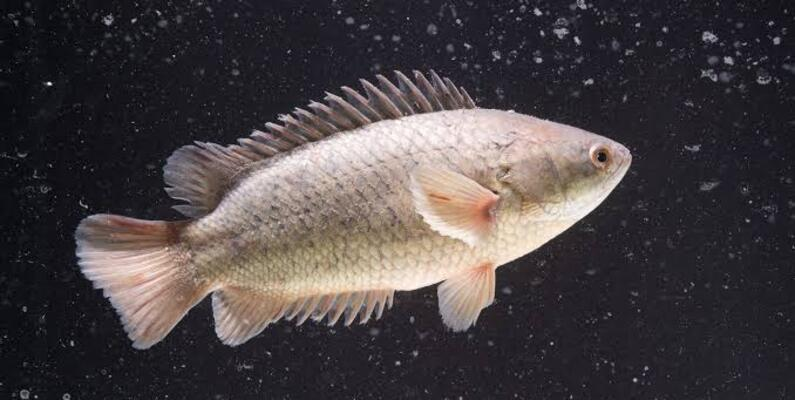
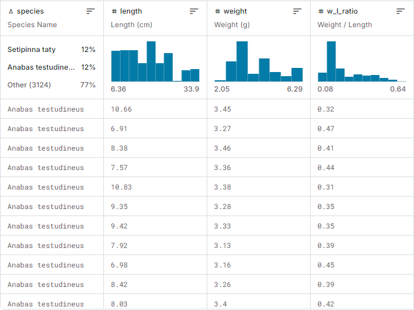

# Fish species sampling weight and height data

The fish species sampling data, including weight and height measurements, are synthetic and inspired by the paper: Length-weight relationships of nine fish species from the Tetulia River, southern Bangladesh( https://www.researchgate.net/figure/Descriptive-statistics-and-estimated-length-weight-relationship-W-aL-b-W-in-g-and-L_tbl1_280916140).

The dataset comprises three key metrics for each fish instance: length, weight, and the ratio of length to weight. In total, the dataset contains 4,080 fish instances, categorized into nine distinct species. The below image shows part of the dataset.

