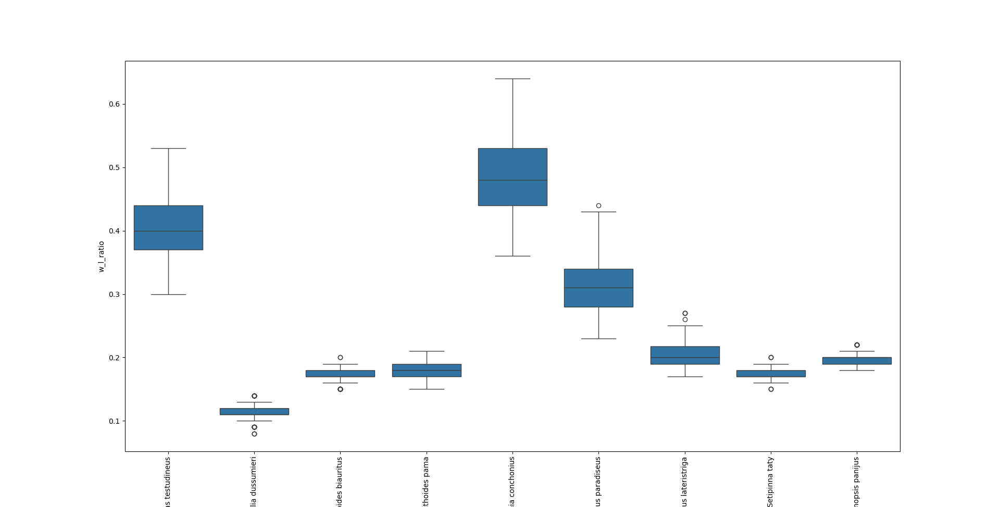

# CS8360-A2

Fish identification can be a time-consuming task, and image classification is currently the most widely used method. However, I believe this dataset offers a new approach to address the problem. In some cases, we may not need highly detailed data, such as RGB images of the fish. Key features like weight, length, and the ratio between weight and length could serve as effective identifiers. These measurements require much less data compared to high-resolution images. This is why I believe that machine learning with discrete data could become a new trend in object identification.

To gain a better understanding of the data distribution in this dataset, I performed some exploratory data analysis (EDA). First, I created a graph showing the fish count versus fish species to examine whether the dataset is evenly distributed across species. The image below illustrates the results. From the line graph, it's clear that the distribution is relatively even. The difference between the majority and minority classes is within 2%.

Secondly, in order to determine which metric is the most effective in distinguishing fish categories, I plotted three graphs showing length, weight, and the weight-to-length ratio against species. From the images below, it's clear that it is difficult to identify a single metric as the most distinguishable. There is significant overlap between the metrics, and the variance is quite apparent.

Finally, I projected all instances onto a length and weight axis, resulting in the graph below. The clustering patterns are clearly visible, making it easy to distinguish the fish using traditional machine learning methods like logistic regression. Based on this, I conclude that this dataset is sufficiently distinct to accurately identify different fish categories.

